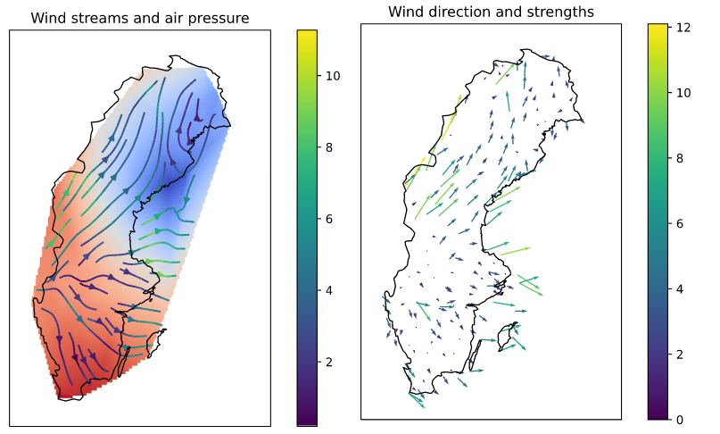

A collection of python scripts to recurrently collect and store meteorological observations by 
[SMHI](https://www.smhi.se/data) and to visualize some observations.

The observations are stored in GeoJSON format are available through [web page](https://www.viltstigen.se/smhi_metobs/) 
or using URL's. 
See detailed description [here](https://wlog.viltstigen.se/articles/2020/07/05/smhi-meteorological-observations/).
Script, see `py/collector_metobs.py` and `py/emitter_metobs.py`.

For visualizations, see https://www.viltstigen.se/smhi_metobs/weather.html
Script, see `py/swe_weather.py`

For installation of geopandas and geoplot, see https://wlog.viltstigen.se/articles/2020/07/07/installing-geopandas-and-geoplot-on-raspberry-pi/
